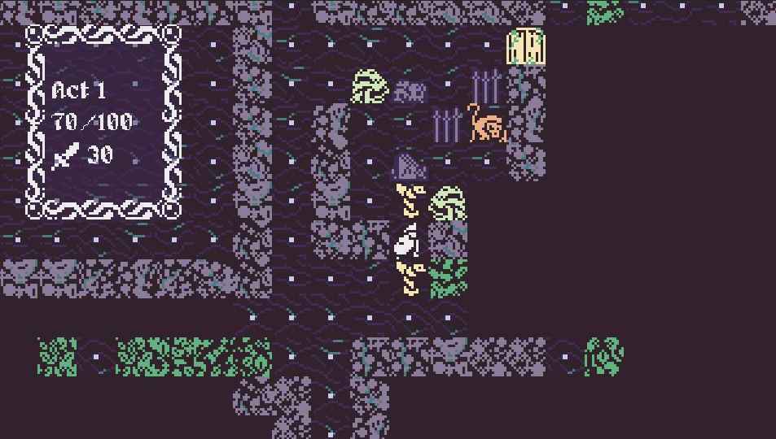
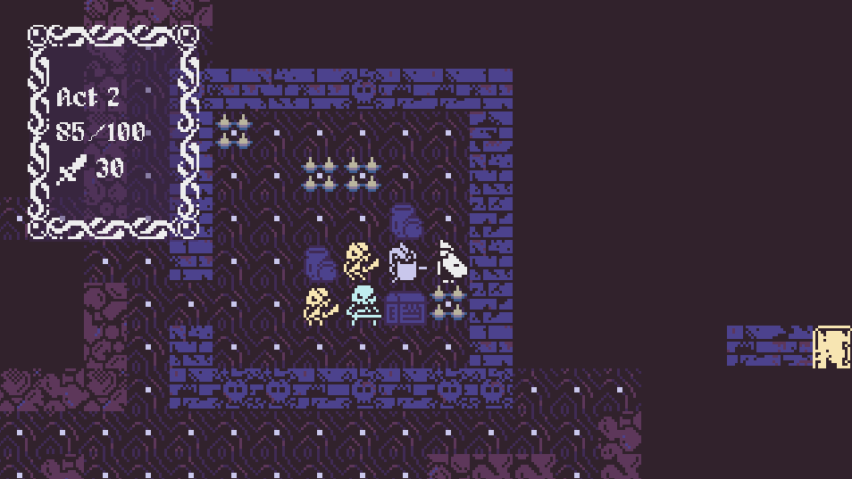
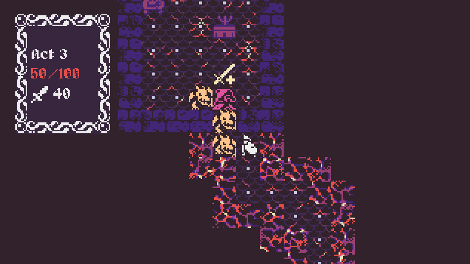
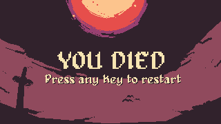

# Abyss

Descend into the abyss, a retro action-roguelike game
Play it on [itch.io](https://ljvmiranda921.itch.io/abyss)

## Screenshots

<table>
  <tr>
    <td></td>
    <td></td>
   </tr> 
   <tr>
    <td></td>
    <td></td>
  </tr>
</table>

## Notes

This is my first Godot learning project in game dev! I won't say this code is
decent at best&mdash; design patterns aren't consistent, alot of hacky tricks,
and no tests! I *might* refactor this in the future, but big chance I'll just
keep it as it is.
